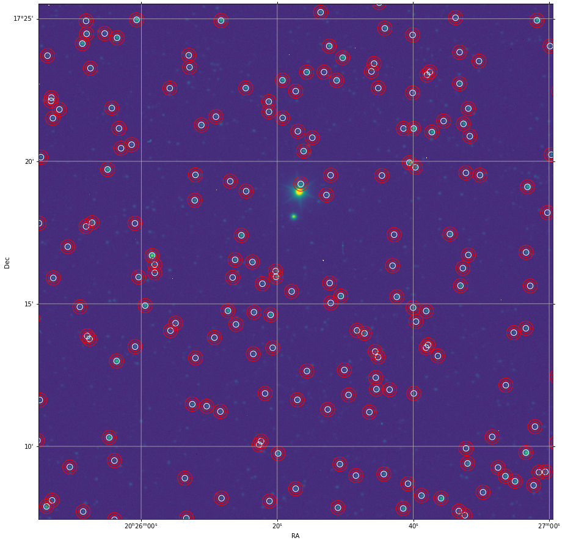

# Star Field Analysis Using the Gaia Catalog

This Jupyter notebook demonstrates how to load astronomical FITS files, define the World Coordinate System (WCS) sky area, download star coordinates from the Gaia catalog using an SQL request, and match the star's instrumental magnitudes with the Gaia apparent magnitudes. Each step of the process is visualized to facilitate understanding of the data and results.



## Getting Started

### Prerequisites

To run this notebook, you will need Python installed on your system along with Jupyter. The notebook uses several Python packages, all of which can be installed via pip:

```bash
pip install numpy matplotlib astropy astroquery
```

### Installation

Clone the repository to your local machine:

```bash
git clone https://github.com/your-username/your-repository.git
cd your-repository
```

Start Jupyter Notebook or JupyterLab:

```bash
jupyter notebook
```

or

```bash
jupyter lab
```

Open the `Astronomical_Data_Analysis.ipynb` file in the Jupyter interface.

## Notebook Overview

The notebook consists of several key sections:

1. **Loading FITS Files**: Load an astronomical FITS file using the `astropy.io.fits` module.
2. **Defining WCS Sky Area**: Use the `astropy.wcs` module to define and understand the WCS information embedded within the FITS file.
3. **Downloading Star Coordinates**: Use `astroquery.gaia` to perform an SQL query to the Gaia catalog and retrieve star coordinates within the defined WCS area.
4. **Matching Magnitudes**: Match the instrumental magnitudes from the FITS data to the apparent magnitudes from the Gaia catalog.
5. **Visualization**: Each step includes visualizations using `matplotlib` and `astropy.visualization` to show the data and the results of analyses like sky maps and magnitude comparisons.

## Usage

Follow the instructions in the notebook, executing each cell consecutively. The notebook is commented with explanations for each step to aid in understanding the processes and operations being performed.

## Contributing

Contributions to this project are welcome. Please fork the repository and submit a pull request with your enhancements.

## License

This project is licensed under the GNU General Public License v3.0. This license allows for free use, modification, and distribution, ensuring that all derivatives of this work are also freely available under the same terms.

## Author

- **Alexey Sergeyev** - [Alexey Sergeyev](https://github.com/AlexeySergeyev)

## Acknowledgments

- Thanks to the Astropy team for creating a powerful tool for astronomical data analysis.
- Acknowledgment to the Gaia archive for providing access to their valuable catalog.

